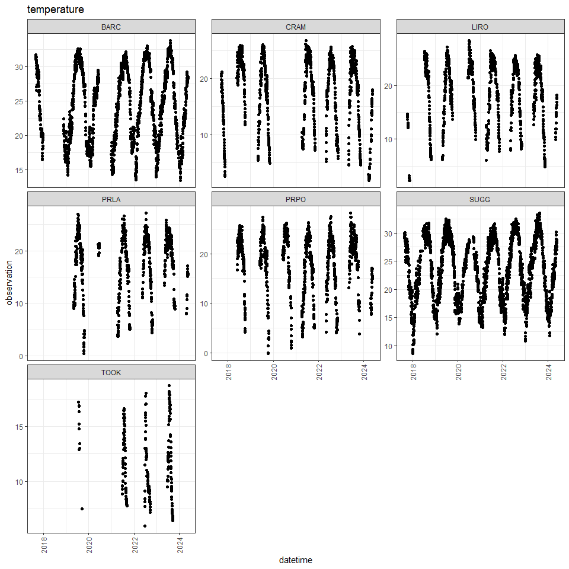
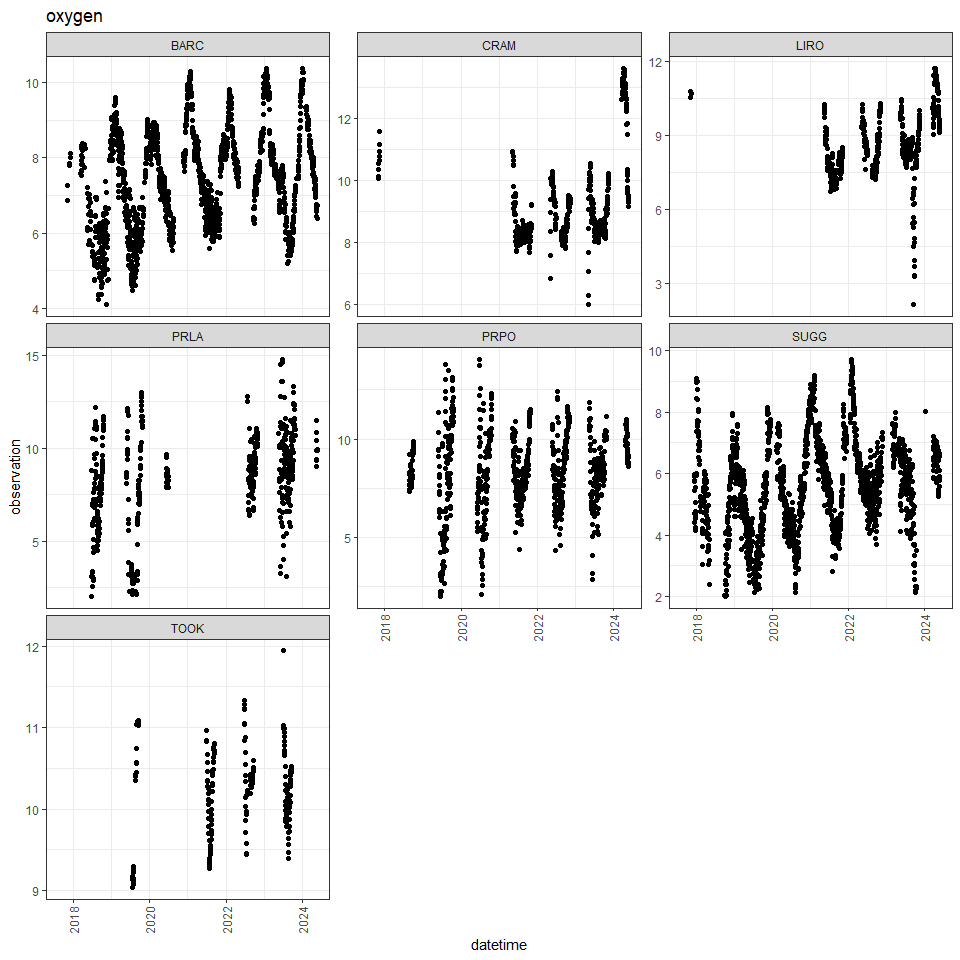
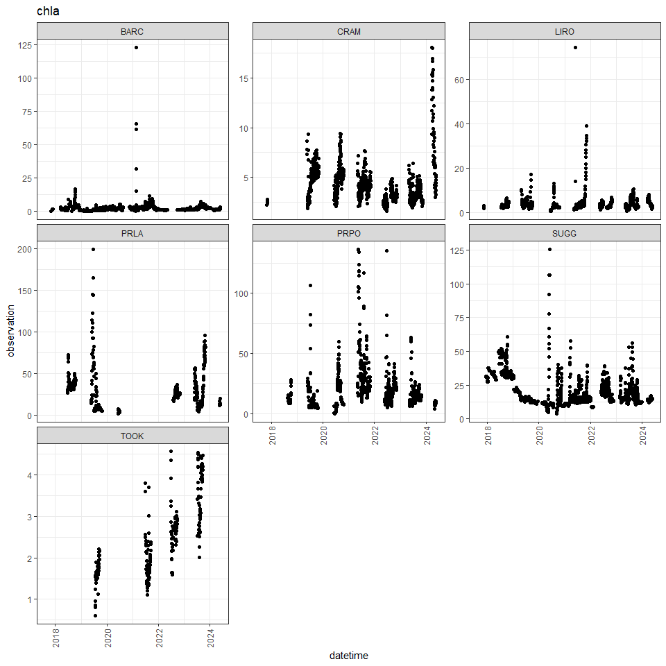

-   [1 This R markdown document](#this-r-markdown-document)
-   [2 Introduction to NEON forecast
    challenge](#introduction-to-neon-forecast-challenge)
    -   [2.1 Aquatics challenge](#aquatics-challenge)
    -   [2.2 Submission requirements](#submission-requirements)
-   [3 The forecasting workflow](#the-forecasting-workflow)
    -   [3.1 Read in the data](#read-in-the-data)
    -   [3.2 Visualise the data](#visualise-the-data)
-   [4 Introducing co-variates](#introducing-co-variates)
    -   [4.1 Download co-variates](#download-co-variates)
        -   [4.1.1 Download historic data](#download-historic-data)
        -   [4.1.2 Download future weather
            forecasts](#download-future-weather-forecasts)
-   [5 Linear model with covariates](#linear-model-with-covariates)
    -   [5.1 Specify forecast model](#specify-forecast-model)
    -   [5.2 Convert to EFI standard for
        submission](#convert-to-efi-standard-for-submission)
    -   [5.3 Submit forecast](#submit-forecast)
    -   [5.4 TASKS](#tasks)
    -   [5.5 Register your participation](#register-your-participation)

# 1 This R markdown document

This document presents workshop materials to get you started on
generating forecasts specifically for submission to the EFI-NEON
Forecasting Challenge. The Challenge goal is to create a community of
practice that builds capacity for ecological forecasting by leveraging
NEON data products. The Challenge revolves around the five theme areas
that span aquatic and terrestrial systems, and population, community,
and ecosystem processes across a broad range of ecoregions that uses
data collected by NEON. Learn more about the Challenge
[here](https://projects.ecoforecast.org/neon4cast-docs/)!

This EFI 2024 workshop is based on materials developed by Freya Olsson
(see original and complete materials
[here](https://github.com/OlssonF/NEON-forecast-challenge-workshop). The
development of these materials has been supported by NSF grants
DEB-1926388 and DBI-1933016.

To complete the workshop via this markdown document the following
packages will need to be installed:

-   `remotes`
-   `tidyverse`
-   `lubridate`
-   `neon4cast` (from github)

The following code chunk should be run to install packages.

``` r
install.packages('remotes')
install.packages('tidyverse') # collection of R packages for data manipulation, analysis, and visualisation
install.packages('lubridate') # working with dates and times
remotes::install_github('eco4cast/neon4cast') # package from NEON4cast challenge organisers to assist with forecast building and submission
```

Additionally, R version 4.2 is required to run the neon4cast package.
It’s also worth checking your Rtools is up to date and compatible with R
4.2, see
(<https://cran.r-project.org/bin/windows/Rtools/rtools42/rtools.html>).

``` r
version$version.string
```

    ## [1] "R version 4.2.0 (2022-04-22 ucrt)"

``` r
library(tidyverse)
```

    ## ── Attaching core tidyverse packages ──────────────────────── tidyverse 2.0.0 ──
    ## ✔ dplyr     1.1.3     ✔ readr     2.1.4
    ## ✔ forcats   1.0.0     ✔ stringr   1.5.1
    ## ✔ ggplot2   3.5.0     ✔ tibble    3.2.1
    ## ✔ lubridate 1.9.3     ✔ tidyr     1.3.1
    ## ✔ purrr     1.0.2     
    ## ── Conflicts ────────────────────────────────────────── tidyverse_conflicts() ──
    ## ✖ dplyr::filter() masks stats::filter()
    ## ✖ dplyr::lag()    masks stats::lag()
    ## ℹ Use the conflicted package (<http://conflicted.r-lib.org/>) to force all conflicts to become errors

``` r
library(lubridate)
library(ggplot2); theme_set(theme_bw())
```

If you do not wish to run the code yourself you can follow along via the
html (NEON_forecast_challenge_workshop.md), which can be downloaded from
the [Github repository](https://github.com/eco4cast).

# 2 Introduction to NEON forecast challenge

The [EFI RCN NEON Forecast
Challenge](https://projects.ecoforecast.org/neon4cast-ci/) asks the
scientific community to produce ecological forecasts of future
conditions at NEON sites by leveraging NEON’s open data products. The
Challenge is split into five themes that span aquatic and terrestrial
systems, and population, community, and ecosystem processes across a
broad range of ecoregions. We are excited to use this Challenge to learn
more about the predictability of ecological processes by forecasting
NEON data before it is collected.

Which modeling frameworks, mechanistic processes, and statistical
approaches best capture community, population, and ecosystem dynamics?
These questions are answerable by a community generating a diverse array
of forecasts. The Challenge is open to any individual or team from
anywhere around the world that wants to submit forecasts. Sign up
[here.](https://forms.gle/kg2Vkpho9BoMXSy57).

## 2.1 Aquatics challenge

What: Freshwater surface water temperature, oxygen, and chlorophyll-a.

Where: 7 lakes and 27 river/stream NEON sites.

When: Daily forecasts for at least 30-days in the future. New forecast
submissions, that use new data to update the forecast, are accepted
daily. The only requirement is that submissions are predictions of the
future at the time the forecast is submitted.

Today we will focus on lake sites only and will start with forecasting
water temperature. For the challenge, you can chose to submit to either
the lakes, rivers or streams or all three! You can also chose to submit
any of the three focal variables (temperature, oxygen, and chlorophyll).
Find more information about the aquatics challenge
[here](https://projects.ecoforecast.org/neon4cast-ci/targets.html#sec-targets).

## 2.2 Submission requirements

For the Challenge, forecasts must include quantified uncertainty. The
file can represent uncertainty using an ensemble forecast (multiple
realizations of future conditions) or a distribution forecast (e.g. a
normal distribution), specified in the family and parameter columns of
the forecast file.

For an ensemble forecast, the `family` column uses the word `ensemble`
to designate that it is a ensemble forecast and the parameter column is
the ensemble member number (1, 2, 3 …). For a distribution forecast, the
`family` column describes the type of distribution and the parameter
column must have the parameterizations of that distribution for each
forecasted variable, site_id, and datetime. The following distributions
are currently supported by the Challenge (family:parameters):

-   `lognormal`: `mu`, `sigma`

-   `normal`: `mu`, `sigma`

-   `bernoulli`: `prob`

-   `beta`: `shape1`, `shape2`

-   `uniform`: `min`, `max`

-   `gamma`: `shape`, `rate`

-   `logistic`: `location`, `scale`

-   `exponential`: `rate`

-   `poisson`: `lambda`

For forecasts that don’t follow one of the supported distributions we
recommend using the ensemble format and sampling from your distribution
to generate a set of ensemble members that represents your distribution.
I will go through examples of both `ensemble` and `normal` forecasts as
examples.

The full list of required columns and format can be found in the
[Challenge
documentation](https://projects.ecoforecast.org/neon4cast-docs/Submission-Instructions.html).

# 3 The forecasting workflow

## 3.1 Read in the data

We start forecasting by first looking at the historic data - called the
‘targets’. These data are available near real-time, with the latency of
approximately 24-48 hrs for the aquatics theme. Here is how you read in
the data from the targets file available as a csv from the EFI S3
storage.

``` r
#read in the targets data
targets <- read_csv("https://sdsc.osn.xsede.org/bio230014-bucket01/challenges/targets/project_id=neon4cast/duration=P1D/aquatics-targets.csv.gz")
```

Information on the NEON sites can be found in the
`NEON_Field_Site_Metadata_20220412.csv` file on GitHub. It can be
filtered to only include aquatic sites. This table has information about
the field sites, including location, ecoregion, information about the
watershed (e.g. elevation, mean annual precipitation and temperature),
and lake depth.

``` r
# read in the sites data
aquatic_sites <- read_csv("https://raw.githubusercontent.com/eco4cast/neon4cast-targets/main/NEON_Field_Site_Metadata_20220412.csv") |>
  dplyr::filter(aquatics == 1)
```

Let’s take a look at the targets data!

    ## # A tibble: 11 × 6
    ##    project_id site_id datetime            duration variable    observation
    ##    <chr>      <chr>   <dttm>              <chr>    <chr>             <dbl>
    ##  1 neon4cast  ARIK    2017-04-23 00:00:00 P1D      temperature       12.7 
    ##  2 neon4cast  ARIK    2017-04-24 00:00:00 P1D      chla              NA   
    ##  3 neon4cast  ARIK    2017-04-24 00:00:00 P1D      oxygen             7.10
    ##  4 neon4cast  ARIK    2017-04-24 00:00:00 P1D      temperature       14.8 
    ##  5 neon4cast  ARIK    2017-04-25 00:00:00 P1D      chla              NA   
    ##  6 neon4cast  ARIK    2017-04-25 00:00:00 P1D      oxygen             6.58
    ##  7 neon4cast  ARIK    2017-04-25 00:00:00 P1D      temperature       15.5 
    ##  8 neon4cast  ARIK    2017-04-26 00:00:00 P1D      chla              NA   
    ##  9 neon4cast  ARIK    2017-04-26 00:00:00 P1D      oxygen             7.32
    ## 10 neon4cast  ARIK    2017-04-26 00:00:00 P1D      temperature       13.0 
    ## 11 neon4cast  ARIK    2017-04-27 00:00:00 P1D      chla              NA

The columns of the targets file show the time step (daily for aquatics
challenge), the 4 character site code (`site_id`), the variable being
measured, and the mean daily observation. To look at only the lakes we
can subset the targets and aquatic sites to those which have the
`field_site_subtype` of `Lake`.

``` r
focal_sites <- aquatic_sites |> 
  filter(field_site_subtype == 'Lake') |> 
  pull(field_site_id)

targets <- targets %>%
  filter(site_id %in% focal_sites)
```

## 3.2 Visualise the data



We can think about what type of models might be useful to predict these
variables at these sites. Below are descriptions of three simple models
which have been constructed to get you started forecasting:

-   We could use information about current conditions to predict the
    next day. What is happening today is usually a good predictor of
    what will happen tomorrow (Persistence).
-   We could also think about what the historical data tells us about
    this time of year. January this year is likely to be similar to
    January last year (Climatology/day-of-year model)
-   And we could look at the lake variables’ relationship(s) with other
    variable. Could we use existing forecasts about the weather to
    generate forecasts about lake variables.

To start, we will produce forecasts for just one of these target
variables, surface water temperature.

``` r
targets <- targets %>%
  filter(variable == 'temperature')
```

# 4 Introducing co-variates

One important step to overcome when thinking about generating forecasts
is to include co-variates in the model. A water temperature forecast,
for example, may be benefit from information about past and future
weather. The `neon4cast` package includes functions for downloading past
and future NOAA weather forecasts for all of the NEON sites. The 3 types
of data are as follows:

-   stage_1: raw forecasts - 31 member ensemble forecasts at 3 hr
    intervals for the first 10 days, and 6 hr intervals for up to 35
    days at the NEON sites.
-   stage_2: a processed version of Stage 1 in which fluxes are
    standardized to per second rates, fluxes and states are interpolated
    to 1 hour intervals and variables are renamed to match conventions.
    We recommend this for obtaining future weather. Future weather
    forecasts include a 30-member ensemble of equally likely future
    weather conditions.
-   stage_3: can be viewed as the “historical” weather and is
    combination of day 1 weather forecasts (i.e., when the forecasts are
    most accurate).

This code create a connection to the dataset hosted on the eco4cast
server (`neon4cast-drivers/noaa/gefs-v12`) using `arrow` functions. To
download the data you have to tell the function to `collect()` it. These
data set can be subsetted and filtered using `dplyr` functions prior to
download to limit the memory usage.

You can read more about the NOAA forecasts available for the NEON sites
[here:](https://projects.ecoforecast.org/neon4cast-docs/Shared-Forecast-Drivers.html)

## 4.1 Download co-variates

### 4.1.1 Download historic data

We will generate a water temperature forecast using `air_temperature` as
a co-variate. Note: This code chunk can take a few minutes to execute as
it accesses the NOAA data.

``` r
met_variables <- c("air_temperature")

#Other variable names can be found at https://projects.ecoforecast.org/neon4cast-docs/Shared-Forecast-Drivers.html#stage-3

# past stacked weather
weather_past_s3 <- neon4cast::noaa_stage3()

weather_past <- weather_past_s3  |> 
  dplyr::filter(site_id %in% focal_sites,
                datetime >= ymd('2017-01-01'),
                variable %in% met_variables) |> 
  dplyr::collect()

weather_past
```

    ## # A tibble: 6,968,521 × 7
    ##    parameter datetime            variable   prediction family reference_datetime
    ##        <dbl> <dttm>              <chr>           <dbl> <chr>  <lgl>             
    ##  1         0 2020-09-24 00:00:00 air_tempe…       297. ensem… NA                
    ##  2         1 2020-09-24 00:00:00 air_tempe…       297. ensem… NA                
    ##  3         2 2020-09-24 00:00:00 air_tempe…       297. ensem… NA                
    ##  4         3 2020-09-24 00:00:00 air_tempe…       297. ensem… NA                
    ##  5         4 2020-09-24 00:00:00 air_tempe…       298. ensem… NA                
    ##  6         5 2020-09-24 00:00:00 air_tempe…       297. ensem… NA                
    ##  7         6 2020-09-24 00:00:00 air_tempe…       297. ensem… NA                
    ##  8         7 2020-09-24 00:00:00 air_tempe…       297. ensem… NA                
    ##  9         8 2020-09-24 00:00:00 air_tempe…       297. ensem… NA                
    ## 10         9 2020-09-24 00:00:00 air_tempe…       297. ensem… NA                
    ## # ℹ 6,968,511 more rows
    ## # ℹ 1 more variable: site_id <chr>

This is a stacked ensemble forecast of the one day ahead forecasts. To
get an estimate of the historic conditions we can take a mean of these
ensembles that can be used in model fitting. We will also convert the
temperatures to Celsius from Kelvin.

``` r
# aggregate the past to mean values
weather_past_daily <- weather_past |> 
  mutate(datetime = as_date(datetime)) |> 
  group_by(datetime, site_id, variable) |> 
  summarize(prediction = mean(prediction, na.rm = TRUE), .groups = "drop") |> 
  pivot_wider(names_from = variable, values_from = prediction) |> 
  # convert air temp to C
  mutate(air_temperature = air_temperature - 273.15)
```

We can then look at the future weather forecasts in the same way but
using the `noaa_stage2()`. The forecast becomes available from NOAA at
5am UTC the following day, so we take the air temperature forecast from
yesterday (`noaa_date`) to make the water quality forecasts. Then we can
use the ensembles to produce uncertainty in the water temperature
forecast by forecasting multiple (31) future water temperatures.

### 4.1.2 Download future weather forecasts

``` r
# New forecast only available at 5am UTC the next day

forecast_date <- Sys.Date() 
noaa_date <- forecast_date - days(1)

weather_future_s3 <- neon4cast::noaa_stage2(start_date = as.character(noaa_date))

weather_future <- weather_future_s3 |> 
  dplyr::filter(datetime >= forecast_date,
                site_id %in% focal_sites,
                variable %in% met_variables) |> 
  collect()
```

The forecasts are hourly and we are interested in using daily mean air
temperature for water temperature forecast generation.

``` r
weather_future_daily <- weather_future |> 
  mutate(datetime = as_date(datetime)) |> 
  # mean daily forecasts at each site per ensemble
  group_by(datetime, site_id, parameter, variable) |> 
  summarize(prediction = mean(prediction), .groups = 'drop') |>
  pivot_wider(names_from = variable, values_from = prediction) |>
  # convert to Celsius
  mutate(air_temperature = air_temperature - 273.15) |> 
  select(datetime, site_id, air_temperature, parameter)

weather_future_daily
```

    ## # A tibble: 7,595 × 4
    ##    datetime   site_id air_temperature parameter
    ##    <date>     <chr>             <dbl>     <dbl>
    ##  1 2024-05-24 BARC               27.5         0
    ##  2 2024-05-24 BARC               27.4         1
    ##  3 2024-05-24 BARC               27.6         2
    ##  4 2024-05-24 BARC               28.2         3
    ##  5 2024-05-24 BARC               27.3         4
    ##  6 2024-05-24 BARC               27.4         5
    ##  7 2024-05-24 BARC               27.3         6
    ##  8 2024-05-24 BARC               27.4         7
    ##  9 2024-05-24 BARC               25.8         8
    ## 10 2024-05-24 BARC               27.6         9
    ## # ℹ 7,585 more rows

Now we have a timeseries of historic data and a 30 member ensemble
forecast of future air temperatures


# 5 Linear model with covariates

We will fit a simple linear model between historic air temperature and
the water temperature targets data. Using this model we can then use our
future estimates of air temperature (all 30 ensembles) to estimate water
temperature at each site. The ensemble weather forecast will therefore
propagate uncertainty into the water temperature forecast and give an
estimate of driving data uncertainty.

We will start by joining the historic weather data with the targets to
aid in fitting the linear model.

``` r
targets_lm <- targets |> 
  filter(variable == 'temperature') |>
  pivot_wider(names_from = 'variable', values_from = 'observation') |> 
  left_join(weather_past_daily, 
            by = c("datetime","site_id"))

targets_lm[2000:2010,]
```

    ## # A tibble: 11 × 6
    ##    project_id site_id datetime            duration temperature air_temperature
    ##    <chr>      <chr>   <dttm>              <chr>          <dbl>           <dbl>
    ##  1 neon4cast  BARC    2023-07-24 00:00:00 P1D             31.8            27.2
    ##  2 neon4cast  BARC    2023-07-25 00:00:00 P1D             31.7            27.8
    ##  3 neon4cast  BARC    2023-07-26 00:00:00 P1D             31.7            28.2
    ##  4 neon4cast  BARC    2023-07-27 00:00:00 P1D             31.8            28.2
    ##  5 neon4cast  BARC    2023-07-28 00:00:00 P1D             31.5            27.5
    ##  6 neon4cast  BARC    2023-07-29 00:00:00 P1D             31.6            28.5
    ##  7 neon4cast  BARC    2023-07-30 00:00:00 P1D             31.9            29.2
    ##  8 neon4cast  BARC    2023-07-31 00:00:00 P1D             31.7            26.6
    ##  9 neon4cast  BARC    2023-08-01 00:00:00 P1D             31.5            28.0
    ## 10 neon4cast  BARC    2023-08-02 00:00:00 P1D             31.7            27.9
    ## 11 neon4cast  BARC    2023-08-03 00:00:00 P1D             31.9            28.1

Set up a dataframe for the results to go into. We will generate a
forecast 35 days into the future

``` r
forecast_df <- NULL
forecast_horizon <- 35
forecast_dates <- seq(from = ymd(forecast_date), to = ymd(forecast_date) + forecast_horizon, by = "day")
```

To fit the linear model we use the base R `lm()` but there are also
methods to fit linear (and non-linear) models in the `fable::` package.
You can explore the
[documentation](https://otexts.com/fpp3/regression.html) for more
information on the `fable::TSLM()` function. We can fit a separate
linear model for each site. For example, at Lake Suggs, this would look
like:

``` r
example_site <- 'SUGG'

site_target <- targets_lm |> 
  filter(site_id == example_site)

weather_future_site <- weather_future_daily |> 
  filter(site_id == example_site)

#Fit linear model based on past data: water temperature = m * air temperature + b
fit <- lm(site_target$temperature ~ site_target$air_temperature)

# Extract the model coefficients that will be used in the forecast
coeff <- fit$coefficients

# Loop through all the forecast dates
for (t in 1:length(forecast_dates)) {
  
  #pull driver ensemble for the relevant date; using all 31 NOAA ensemble members
  temp_driv <- weather_future_site %>%
    filter(datetime == forecast_dates[t])
  
  # use linear regression to forecast water temperature for each ensemble member
  forecasted_temperature <- fit$coefficients[1] + fit$coefficients[2] * temp_driv$air_temperature
  # put all the relevant information into a tibble that we can bind together
  curr_site_df <- tibble(datetime = temp_driv$datetime,
                         site_id = example_site,
                         parameter = temp_driv$parameter,
                         prediction = forecasted_temperature,
                         variable = "temperature") #Change this if you are forecasting a different variable
  
  forecast_df <- dplyr::bind_rows(forecast_df, curr_site_df)
  
}
```

We can use a for loop to use the same workflow for each site to create a
site-wise forecast of water temperature based on a linear model and each
site’s forecasted air temperature. We can run this forecast for each
site and then bind them together to submit as one forecast.

## 5.1 Specify forecast model

``` r
forecast_df <- NULL
forecast_horizon <- 35
forecast_dates <- seq(from = ymd(forecast_date), to = ymd(forecast_date) + forecast_horizon, by = "day")

for(i in 1:length(focal_sites)) {  
  
  example_site <- focal_sites[i]
  
  site_target <- targets_lm |> 
    filter(site_id == example_site)
  
  weather_future_site <- weather_future_daily |> 
    filter(site_id == example_site)
  
  #Fit linear model based on past data: water temperature = m * air temperature + b
  fit <- lm(site_target$temperature ~ site_target$air_temperature)
  
  # Extract the model coefficients that will be used in the forecast
  coeff <- fit$coefficients
  
  # Loop through all the forecast dates
  for (t in 1:length(forecast_dates)) {
    
    #pull driver ensemble for the relevant date; using all 31 NOAA ensemble members
    temp_driv <- weather_future_site %>%
      filter(datetime == forecast_dates[t])
    
    # use linear regression to forecast water temperature for each ensemble member
    forecasted_temperature <- fit$coefficients[1] + fit$coefficients[2] * temp_driv$air_temperature
    # put all the relevant information into a tibble that we can bind together
    curr_site_df <- tibble(datetime = temp_driv$datetime,
                           site_id = example_site,
                           parameter = temp_driv$parameter,
                           prediction = forecasted_temperature,
                           variable = "temperature") #Change this if you are forecasting a different variable
    
    forecast_df <- dplyr::bind_rows(forecast_df, curr_site_df)
    
  }
  message(example_site, ' forecast run')
  
}
```

    ## BARC forecast run

    ## CRAM forecast run

    ## LIRO forecast run

    ## PRLA forecast run

    ## PRPO forecast run

    ## SUGG forecast run

    ## TOOK forecast run

We now have 30 possible forecasts of water temperature at each site and
each day. On this plot each line represents one of the possible
forecasts and the range of forecasted water temperature is a simple
quantification of the uncertainty in our forecast.

Looking back at the forecasts we produced:


## 5.2 Convert to EFI standard for submission

For an ensemble forecast the documentation specifies the following
columns:

-   `datetime`: forecast timestamp for each time step
-   `reference_datetime`: The start of the forecast; this should be 0
    times steps in the future. This should only be one value of
    reference_datetime in the file
-   `site_id`: NEON code for site
-   `family`: name of probability distribution that is described by the
    parameter values in the parameter column; only `normal` or
    `ensemble` are currently allowed.
-   `parameter`: integer value for forecast replicate (from the `.rep`
    in fable output);
-   `variable`: standardized variable name from the theme
-   `prediction`: forecasted value (from the `.sim` column in fable
    output)
-   `model_id`: model name (no spaces). Any model_id that includes
    ‘example’ will not be included in analysis. It will still be
    evaluated against observations but will be deleted. This is good for
    testing and trying out new modelling ideas.

We need to make sure the dataframe is in the correct format and then we
can submit this to the challenge as well! This is an ensemble forecast
(specified in the `family` column).

``` r
# Remember to change the model_id when you make changes to the model structure!
my_model_id <- 'example_ID'

forecast_df_EFI <- forecast_df %>%
  filter(datetime > forecast_date) %>%
  mutate(model_id = my_model_id,
         reference_datetime = forecast_date,
         family = 'ensemble',
         parameter = as.character(parameter)) %>%
  select(datetime, reference_datetime, site_id, family, parameter, variable, prediction, model_id)
```

## 5.3 Submit forecast

Files need to be in the correct format for submission. The forecast
organizers have created tools to help aid in the submission process.
These tools can be downloaded from Github using
`remotes::install_github(eco4cast/neon4cast)`. These include functions
for submitting, scoring and reading forecasts:

-   `submit()` - submit the forecast file to the neon4cast server where
    it will be scored
-   `forecast_output_validator()` - will check the file is in the
    correct format to be submitted

The file name needs to be in the format
theme-reference_datetime-model_id

``` r
# Start by writing the forecast to file
theme <- 'aquatics'
date <- forecast_df_EFI$reference_datetime[1]
forecast_name <- paste0(forecast_df_EFI$model_id[1], ".csv")
forecast_file <- paste(theme, date, forecast_name, sep = '-')
forecast_file
```

    ## [1] "aquatics-2024-05-24-example_ID.csv"

``` r
write_csv(forecast_df_EFI, forecast_file)

neon4cast::forecast_output_validator( forecast_file)
```

    ## aquatics-2024-05-24-example_ID.csv

    ## ✔ file has model_id column
    ## ✔ forecasted variables found correct variable + prediction column
    ## ✔ temperature is a valid variable name
    ## ✔ file has correct family and parameter columns
    ## ✔ file has site_id column
    ## ✔ file has datetime column
    ## ✔ file has correct datetime column

    ## Warning: file missing duration column (values for the column: daily = P1D,
    ## 30min = PT30M)

    ## Warning: file missing project_id column (use `neon4cast` as the project_id

    ## ✔ file has reference_datetime column
    ## Forecast format is valid

    ## [1] TRUE

``` r
# can uses the neon4cast::forecast_output_validator() to check the forecast is in the right format
neon4cast::submit(forecast_file = forecast_file,
                  ask = FALSE) # if ask = T (default), it will produce a pop-up box asking if you want to submit
```

Is the linear model a reasonable relationship between air temperature
and water temperature? Would some non-linear relationship be better?
What about using yesterday’s air and water temperatures to predict
tomorrow? Or including additional parameters? There’s a lot of
variability in water temperatures unexplained by air temperature alone.
Could we use the residuals from this fit to add an extra source of
uncertainty?


## 5.4 TASKS

Possible modifications to this very simple linear model:

-   Include additional NOAA co-variates in the linear model (remember to
    ‘collect’ and subset the right data from NOAA)
-   Specify a non-linear relationship
-   Try forecasting another variable (oxygen or chlorophyll) - could you
    use your water temperature to estimate dissolved oxygen
    concentration at the surface?
-   Include a lag in the predictors

Remember to change the `model_id` so we can differentiate different
forecasts!

## 5.5 Register your participation

It’s really important that once you start submitting forecasts to the
Challenge that you register your participation. We ask that you complete
this [form](https://nd.qualtrics.com/jfe/form/SV_9MJ29y2xNrBOjqZ) which
asks you some simple questions about your forecast and team. This is
crucial for a couple of reasons:

1.  We can keep track different forecast submissions during the scoring
    process to see which forecast is performing the best. Your
    `model_id` will be used to track the submissions so any new forecast
    model requires a new `model_id`.
2.  The form gives consent for submissions to be included in
    Challenge-wide syntheses being carried out by the Challenge
    organisers. Long-term partipants in the Challenge will be invited to
    join the synthesis projects on an opt-in basis.

Questions about Challenge registration and synthesis participation can
be directed to [Freya Olsson](mailto:freyao@vt.edu).
