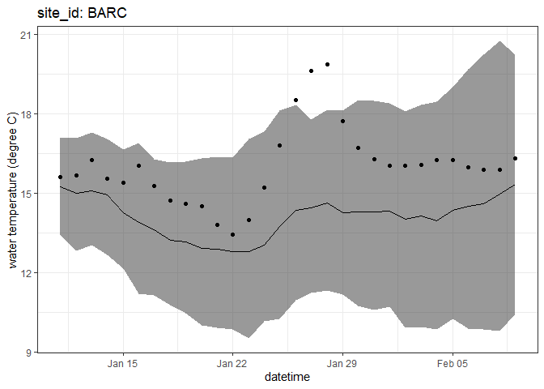
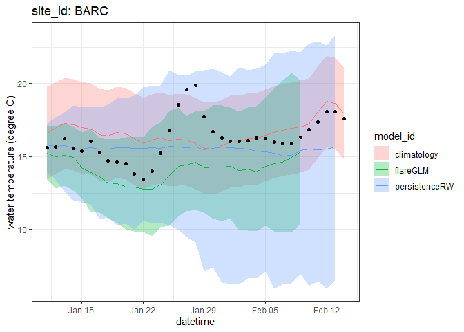
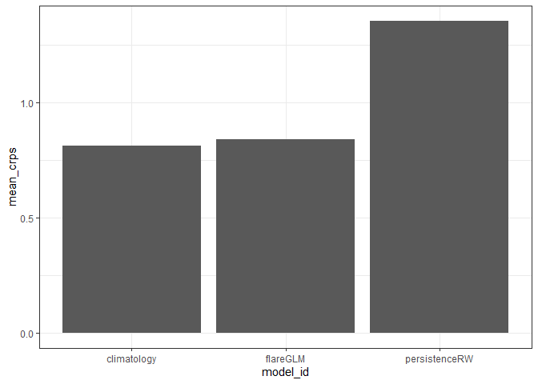
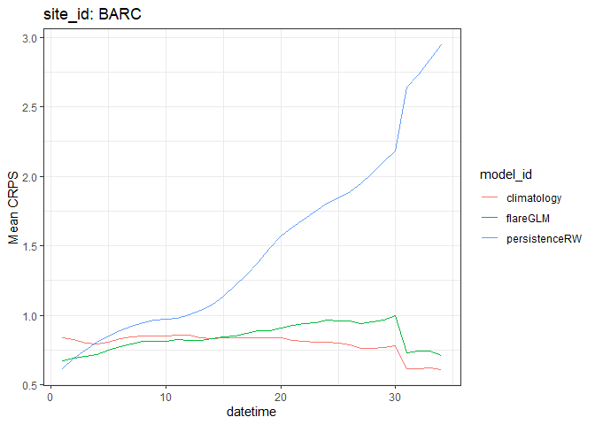
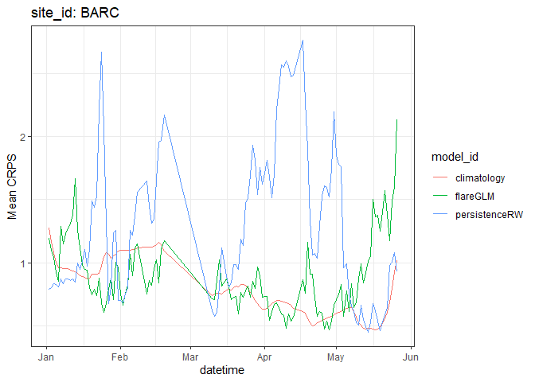

Forecast synthesis
================
Quinn Thomas
2024-05-30

## Analyzing submitted forecasts

- Forecasts: data table with all ensemble members or parametric
  parameters (multiple rows per forecast). This is the largest database
  and slowest to access.  
- Summaries: data table with a single row per
  datetime-reference_datetime combination. Forecasts are collpased down
  to statistical descriptions (mean, median) and forecast quantiles
  (2.5%, 97.5%, etc). This is quicker to access and require less data
  transfer than the full forecasts.
- Scores: data table with the summaries along with the observations and
  the scores that require analysis of the full ensemble or parametric
  forecast. These include the crps or log score. Other model performance
  statistics (such as RMSE) can be calculated from the columns in the
  scores table.

## Database structure

The forecasts, summaries, and scores are stored on the S3 storage as
parquet files organized in a structured way. You do not need to directly
download and read in the parquet files because the `arrow` package
handles this automatically. The database is structured using partitions
that were set to facilitate synthesis and the daily updating of the
database. The forecasts and summaries are organized by:

1.  project_id: this allows the separation of different forecasting
    challenges (neon4cast, vera4cast, etc.)
2.  duration: this allows the separation of variables with the same name
    but different scales of aggregation (i.e. daily carbon fluxes vs 30
    minute carbon fluxes)
3.  variable: this is the forecasted variable
4.  model_id: this is the individual forecast model
5.  reference_datetime: this is the date that a forecast was generated
6.  The actual parquet file sits within the last partition and contains
    all the site_ids that were forecasted

The scores are organized slightly different because all datetimes are
scored as the same time as new data is available. Partitioning them this
way is more efficient because all horizons in a forecast don’t need to
be repeatedly scored when only one datetime within the forecast has new
data.

1.  project_id: this allows the separation of different forecasting
    challenges (neon4cast, vera4cast, etc.)
2.  duration: this allows the separation of variables with the same name
    but different scales of aggregation (i.e. daily carbon fluxes vs 30
    minute carbon fluxes)
3.  variable: this is the forecasted variable
4.  model_id: this is the individual forecast model
5.  datetime: this is the date that a forecast applies too
6.  The actual parquet file sits within the last partition and contains
    all the site_ids that were forecasted

Here is an example when all the partitions are represented in a path:

`scores/parquet/project_id=neon4cast/duration=P1D/variable=temperature/model_id=flareGLM/datetime=2024-01-01/part-0.parquet`

But a path may go to any level of partition. But you cannot skip
partitions.

## Find link to model

1.  Catalog of all forecasts, summaries, and scores

<https://radiantearth.github.io/stac-browser/#/external/raw.githubusercontent.com/eco4cast/challenge-catalogs/main/catalog.json?.language=en>

Navigate to water temperature scores from the flareGLM model. This
includes the forecast summary statistics, observations and scores.

Under “Database Access for Daily Water_temperature”. Click “Copy URL for
S3”

Link to code

``` r
s3_link_scores <- "s3://anonymous@bio230014-bucket01/challenges/scores/parquet/project_id=neon4cast/duration=P1D/variable=temperature/model_id=flareGLM?endpoint_override=sdsc.osn.xsede.org"
```

## Access forecast scores

``` r
my_results <- arrow::open_dataset(s3_link_scores)
df <- my_results |> 
  filter(site_id == "BARC",
         reference_datetime > as_date("2024-01-01")) |> 
  collect()
```

``` r
glimpse(df)
```

    ## Rows: 3,561
    ## Columns: 16
    ## $ reference_datetime <dttm> 2024-01-02, 2024-01-02, 2024-01-03, 2024-01-02, 20…
    ## $ site_id            <chr> "BARC", "BARC", "BARC", "BARC", "BARC", "BARC", "BA…
    ## $ datetime           <dttm> 2024-01-03, 2024-01-04, 2024-01-04, 2024-01-05, 20…
    ## $ family             <chr> "sample", "sample", "sample", "sample", "sample", "…
    ## $ pub_datetime       <dttm> 2024-01-09 02:31:06, 2024-01-09 02:31:06, 2024-01-…
    ## $ observation        <dbl> 15.44031, 15.43674, 15.43674, 15.33339, 15.33339, 1…
    ## $ crps               <dbl> 1.1840918, 1.3991725, 0.5479932, 1.1744891, 0.50154…
    ## $ logs               <dbl> 1.977274, 2.321361, 1.435022, 2.055589, 1.401732, 1…
    ## $ mean               <dbl> 13.57361, 13.30258, 14.51652, 13.47152, 14.53343, 1…
    ## $ median             <dbl> 13.52994, 13.34966, 14.58444, 13.42974, 14.48292, 1…
    ## $ sd                 <dbl> 1.4149565, 1.5026123, 1.0531399, 1.5096690, 1.11562…
    ## $ quantile97.5       <dbl> 15.98929, 16.28003, 16.72196, 16.53670, 16.90728, 1…
    ## $ quantile02.5       <dbl> 10.69493, 10.51829, 12.21023, 10.57883, 12.32851, 1…
    ## $ quantile90         <dbl> 15.76002, 15.63188, 16.17301, 15.87303, 16.52367, 1…
    ## $ quantile10         <dbl> 11.06317, 10.92490, 12.53297, 11.12686, 12.76713, 1…
    ## $ date               <chr> "2024-01-03", "2024-01-04", "2024-01-04", "2024-01-…

## Visualize single forecast

``` r
df |> 
  filter(reference_datetime == as_date("2024-01-10")) |> 
  ggplot(aes(x = datetime)) +
  geom_ribbon(aes(ymin = quantile02.5, ymax = quantile97.5), alpha = 0.5) +
  geom_line(aes(y = median)) +
  geom_point(aes(y = observation)) +
  labs(x = "datetime", y = "water temperature (degree C)", title = "site_id: BARC") +
  theme_bw()
```

<!-- -->

## Aggregated scores

We can look at the mean score for the process model but this provides
very little context for the quality of forecast. It is more informative
to compare the score to the score from other models.

``` r
df |> 
  summarise(mean_crps = mean(crps, na.rm = TRUE))
```

    ## # A tibble: 1 × 1
    ##   mean_crps
    ##       <dbl>
    ## 1     0.843

## Comparing to baselines

We will benchmark our process model forecast against to two “naive”
baselines of `climatology` and `persistenceRW`. You can find the link
here:

<https://radiantearth.github.io/stac-browser/#/external/raw.githubusercontent.com/eco4cast/neon4cast-ci/main/catalog/scores/Aquatics/Daily_Water_temperature/collection.json>

Because we need two different models we will use a higher partition:

``` r
all_models_link <- "s3://anonymous@bio230014-bucket01/challenges/scores/parquet/project_id=neon4cast/duration=P1D/variable=temperature?endpoint_override=sdsc.osn.xsede.org"
```

And then use `filter()` before collecting:

``` r
all_results <- arrow::open_dataset(all_models_link)
df_with_baselines <- all_results |> 
  filter(site_id == "BARC",
         reference_datetime > as_date("2024-01-01"), 
         model_id %in% c("flareGLM", "climatology", "persistenceRW")) |> 
  collect()
```

## Visualization

How do the forecasts look for a single `reference_datetime`

``` r
df_with_baselines |> 
  filter(as_date(reference_datetime) == as_date("2024-01-10")) |> 
  ggplot(aes(x = datetime)) +
  geom_ribbon(aes(ymin = quantile02.5, ymax = quantile97.5, fill = model_id), alpha = 0.3) +
  geom_line(aes(y = median, color = model_id)) +
  geom_point(aes(y = observation)) +
  labs(x = "datetime", y = "water temperature (degree C)", title = "site_id: BARC") +
  theme_bw()
```

<!-- -->

## Aggregated scores

We can first look at the aggregated scores (all reference_datetime and
datetime combinations). Importantly, the code below uses `pivot_wider`
and `pivot_longer` to ensure we only include `datetime` values where all
three models provided forecasts. Otherwise there would be different
periods from the three models in the aggregated score.

``` r
df_with_baselines |> 
  select(model_id, crps, datetime, reference_datetime) |> 
  pivot_wider(names_from = model_id, values_from = crps) |> 
  na.omit() |> 
  pivot_longer(-c(datetime, reference_datetime), names_to = "model_id", values_to = "crps") |> 
  summarise(mean_crps = mean(crps), .by = c("model_id")) |> 
  ggplot(aes(x = model_id, y = mean_crps)) +
  geom_bar(stat="identity") +
  theme_bw()
```

<!-- -->

## By horizon

How does forecast performance change as forecasts extend farther in the
future (increasing horizon), regardless of when the forecast was
produced?

``` r
df_with_baselines |> 
  mutate(horizon = as.numeric(datetime - reference_datetime)) |> 
  select(model_id, horizon, datetime, reference_datetime, crps) |> 
  pivot_wider(names_from = model_id, values_from = crps) |> 
  na.omit() |> 
  pivot_longer(-c(horizon, datetime, reference_datetime), names_to = "model_id", values_to = "crps") |> 
  summarize(mean_crps = mean(crps), .by = c("model_id", "horizon")) |> 
  ggplot(aes(x = horizon, y = mean_crps, color = model_id)) + 
  geom_line() +
  labs(x = "datetime", y = "Mean CRPS", title = "site_id: BARC") +
  theme_bw()
```

<!-- -->

## By reference datetime

How does forecast performance vary across the dates that the forecasts
are generated, regardless of horizon?

``` r
df_with_baselines |> 
  select(model_id, datetime, reference_datetime, crps) |> 
  pivot_wider(names_from = model_id, values_from = crps) |> 
  na.omit() |> 
  pivot_longer(-c(datetime, reference_datetime), names_to = "model_id", values_to = "crps") |> 
  summarize(mean_crps = mean(crps), .by = c("model_id", "reference_datetime")) |> 
  ggplot(aes(x = reference_datetime, y = mean_crps, color = model_id)) + 
  geom_line() +
  labs(x = "datetime", y = "Mean CRPS", title = "site_id: BARC") +
  theme_bw()
```

<!-- -->

## Task: Additional comparisons

My modifying the code above include sites BARC and SUGG. Evaluate
whether the `flareGLM` model performs better relative to the baselines
in one lake vs. the other (aggregated across `horizon` and
`reference_datetime`)

``` r
#Add code here
```
